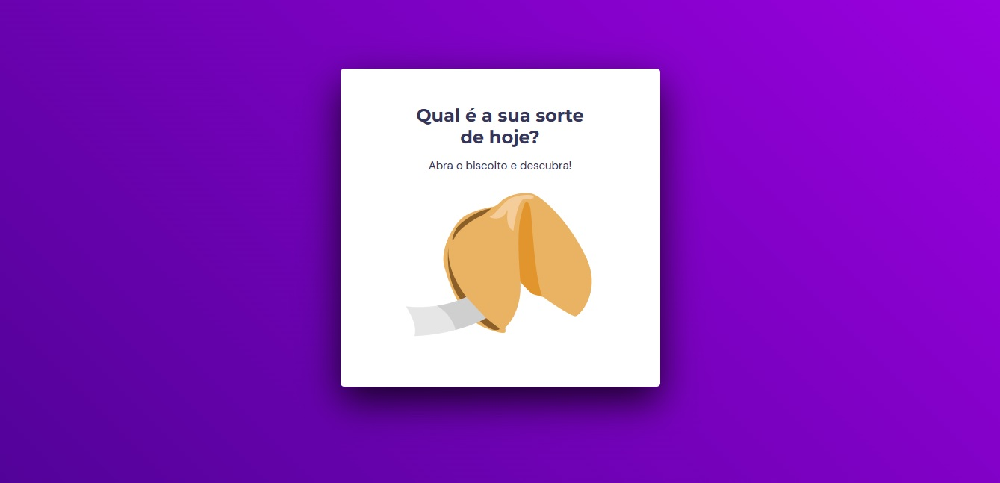

<h1 align="center"> Stage 05 - Biscoito da Sorte</h1>

# Projeto desenvolvido como o primeiro desafio do nível 5 das aulas da trilha Explorer da Rocketseat.
- Neste primeiro desafio, foram aplicados os conhecimentos de DOM no JavaScript para desenvolver uma aplicação de frases aleatórias. E também foram aplicado alguns conceitos de callback, eventos e node.

  <a href="#-tecnologias">Tecnologias</a>&nbsp;&nbsp;&nbsp;|&nbsp;&nbsp;&nbsp;
  <a href="#-projeto">Projeto</a>&nbsp;&nbsp;&nbsp;|&nbsp;&nbsp;&nbsp;
  <a href="inserir link da página aqui" target="_blank">Layout</a>&nbsp;&nbsp;&nbsp;|&nbsp;&nbsp;&nbsp;
  <a href="#memo-licença">Licença</a>

  

 

  

  

## 🚀 Tecnologias
Esse projeto foi desenvolvido com as seguintes tecnologias:
- HTML
- CSS
- JavaScript
- DOM
- Git e Github
- Figma

## 💻 Projeto
Atividade feita no desafio proposto no curso Explorer da Rocketseat. 
- [Acesse o projeto finalizado, online](https://gabriel-adsv.github.io/estiloux-frontend/)

## 📧 Contato
- gabriel.dms@gmail.com

## 📝 Licença
Esse projeto está sob a licença MIT.

---
Realizado por Gabriel Augusto
